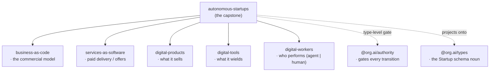
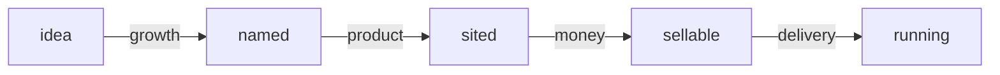

# autonomous-startups

**The abstract self-running startup.** This is the capstone conceptual primitive: it defines what an autonomous startup *is* by composing exactly five primitives — the commercial model, its paid delivery, what it sells, what it wields, and who performs the work — and gates every lifecycle transition with `@org.ai/authority`.

It is a **definition kit**: types, a `defineStartup()` constructor, an authority-gated lifecycle walk, and validation. Pure domain — no HTTP, no database, no platform coupling. The only runtime dependency is `@org.ai/types`, whose `Startup` schema noun it *consumes* rather than redefines.

## What an autonomous startup is

An autonomous startup is the composition of five primitives plus a construction lifecycle. Each register answers one question:

| Register | Question | Primitive |
|---|---|---|
| `business` | What is the commercial model? | [`business-as-code`](../business-as-code) |
| `offers` | How does paid value cross the boundary? | [`services-as-software`](../services-as-software) |
| `products` | What does it sell? | [`digital-products`](../digital-products) |
| `tools` | What does it wield? | [`digital-tools`](../digital-tools) |
| `workforce` | Who performs the work? | [`digital-workers`](../digital-workers) (`agent` \| `human`) |

The workforce is the [`digital-workers`](../digital-workers) interface over both autonomous agents and humans, so a startup composes its labor uniformly regardless of who performs each unit of work.



## The lifecycle

A startup is *constructed* through a linear, forward-only lifecycle. Each state has exactly one legal successor, and each transition draws on a distinct competence domain from `@org.ai/authority`:



`advance()` walks a construct one step forward. It is gated by `@org.ai/authority` **at the type level**: the caller must present an unforgeable `Passed` token whose competence domain is exactly the one the transition draws on and whose principal is exactly the startup's tenant. A wrong-domain token, a token minted for another tenant, or advancing a terminal `running` startup is a **compile error** — not a runtime check. The token is a compile-time proof; nothing about it is inspected at runtime, so the capstone carries no authority machinery.

This construction lifecycle is distinct from the maturity `stage` on the `Startup` data noun (`idea | validating | building | scaling | established`), which each construct projects onto.

## Position in the G1–G5 ladder

`autonomous-startups` defines the **G3 abstraction** — the abstract artifact — in the platform's layering:

- **G1 — seed:** public standards (NAICS, O*NET, UNSPSC, …) at `standards.org.ai`.
- **G2 — canon:** the `.org.ai` properties canonicalize the graph; **`startups.org.ai`** is this primitive's canon.
- **G3 — abstract:** this primitive defines what a startup *is*; the builders (`startup-builder`) build the abstract artifact.
- **G4 — branded:** a brand and a priced offer mint the concrete startup, homed on a commercial property.
- **G5 — tenant:** a live, running startup is a tenant instance operated on **`startups.studio`**, behind the authority membrane.

> Standards seed the graph → the `.org.ai` properties canonicalize it → this primitive defines and the builders build the abstract artifact → a brand + offer mint the startup → tenants run it.

## Usage

Define a startup, validate it, and walk it forward under authority.

```typescript
import { defineStartup, advance, validateStartup } from 'autonomous-startups'
import { tenant } from '@org.ai/authority'

// The five registers come from their primitives; sketched here for shape.
const inboxZero = defineStartup({
  name: 'Inbox Zero',
  description: 'An autonomous startup that triages a team’s inbox to empty, every day.',
  industry: 'Productivity',
  principal: tenant('inbox-zero'),

  business,   // business-as-code:        the commercial model
  offers,     // services-as-software:    "Managed inbox triage" delivered as software
  products,   // digital-products:        the "Inbox Zero" API and dashboard
  tools,      // digital-tools:           the mail, calendar, and search tools it wields
  workforce,  // digital-workers:         a triage agent + a human escalation reviewer
})

// Readiness is validation, not exceptions — issues come back typed.
const { valid, issues } = validateStartup(inboxZero)
// issues: e.g. { code: 'workforce.empty', severity: 'warning', path: 'composition.workforce', ... }

// Walk the construct forward. Each `advance` demands the authority token for that exact
// transition; the type system rejects a wrong-domain or wrong-tenant token at compile time.
const named = advance(inboxZero, growthPass)   // idea → named   (draws on 'growth')
const sited = advance(named, productPass)       // named → sited  (draws on 'product')
const sellable = advance(sited, moneyPass)      // sited → sellable ('money')
const running = advance(sellable, deliveryPass) // sellable → running ('delivery')

// The construct projects onto the canonical schema.org.ai/Startup noun for free.
running.startup // { $type: 'https://schema.org.ai/Startup', name: 'Inbox Zero', stage: 'scaling', ... }
```

In production the `Passed` tokens are minted by an `@org.ai/authority` gate; they cannot be constructed by hand, which is what makes each transition genuinely gated.

## Surface

- `defineStartup(spec)` → `AutonomousStartup<'idea'>` — compose the five registers into a construct at the `idea` state.
- `advance(startup, authorityToken)` → the construct at its next state — the authority-gated, type-safe lifecycle walk.
- `validateStartup(startup)` → `{ valid, issues }` — readiness validation that returns typed issues and never throws.
- `toStartupNoun(startup)` → `StartupType` — the projection onto the canonical `Startup` data noun.
- Lifecycle machine: `LIFECYCLE_STATES`, `NEXT_STATE`, `TRANSITION_DOMAIN`, `legalNextStates`, `canTransition`.
- Types: `StartupSpec`, `AutonomousStartup`, `StartupComposition`, `LifecycleState`, `NextOf`, `DomainOf`, `ValidationResult`, `ValidationIssue`.

## License

MIT
