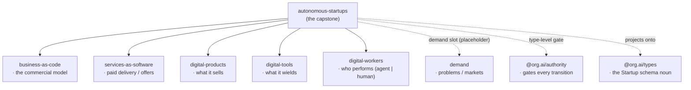
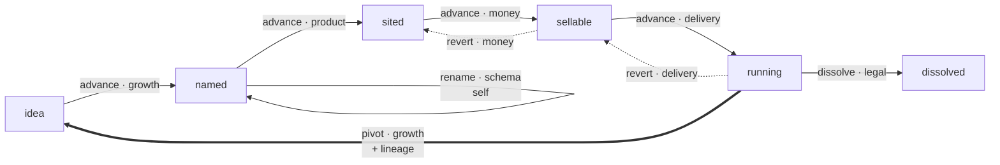

# autonomous-startups

**The abstract self-running startup.** This is the capstone conceptual primitive: it defines what an autonomous startup *is* by **composing conceptual primitives** — `CANONICAL_FIVE` by default (the commercial model, its paid delivery, what it sells, what it wields, and who performs the work) — and walks a construct through **lifecycle@1**, a versioned stategraph whose every mutating edge is gated by `@org.ai/authority`.

It is a **definition kit**: a primitive registry, a `compose(primitives)` blueprint with `defineStartup(spec)` as sugar over it, the authority-gated lifecycle@1 edges, and validation. Pure domain — no HTTP, no database, no platform coupling. The only runtime dependency is `@org.ai/types`, whose `Startup` schema noun it *consumes* rather than redefines.

> **v2 (ADR 0001 amendment 3).** Composition is now open: `compose(primitives)` over a registry-resolved profile (`CANONICAL_FIVE` is the default), and the lifecycle is a versioned **stategraph** with `advance` / `revert` / `pivot` / `dissolve` / `rename` edges and a `live` predicate — replacing the old linear, forward-only walk. A composable `demand` register (problems / markets) is reserved as a type-level slot.

## What an autonomous startup is

An autonomous startup is a **composition of primitives** plus a lifecycle. The default profile — `CANONICAL_FIVE` — binds five supply-side registers, each answering one question:

| Register | Question | Primitive |
|---|---|---|
| `business` | What is the commercial model? | [`business-as-code`](../business-as-code) |
| `offers` | How does paid value cross the boundary? | [`services-as-software`](../services-as-software) |
| `products` | What does it sell? | [`digital-products`](../digital-products) |
| `tools` | What does it wield? | [`digital-tools`](../digital-tools) |
| `workforce` | Who performs the work? | [`digital-workers`](../digital-workers) (`agent` \| `human`) |

The workforce is the [`digital-workers`](../digital-workers) interface over both autonomous agents and humans, so a startup composes its labor uniformly regardless of who performs each unit of work.

### Composing a profile

`compose(primitives)` builds a **blueprint** over a *profile* — an ordered set of primitives drawn from the `PRIMITIVE_REGISTRY`. `CANONICAL_FIVE` is the registry-resolved default, so `compose()` is the canonical startup and `defineStartup(spec)` is exactly `compose().define(spec)`. A custom profile changes which slots are bound — for example, adding the composable **`demand`** register:

```typescript
import { compose, resolveProfile, CANONICAL_FIVE_IDS } from 'autonomous-startups'

const withDemand = resolveProfile([...CANONICAL_FIVE_IDS, 'demand'])
const startup = compose(withDemand).define({ name: 'Inbox Zero', business, demand })
// startup.composition.demand is bound; under the default CANONICAL_FIVE profile it is not.
```

The **demand register** (`problems` / `markets`) is a *type-level placeholder* — the composable counterpart to the five supply primitives, reserved for when `problems.org.ai` and a markets register are ratified. It carries no implementation yet (ADR 0001 fixation gate).



## lifecycle@1 — the stategraph

A startup is walked through **lifecycle@1**, an explicit, versioned stategraph. Six states — five live (`idea → named → sited → sellable → running`) plus the terminal `dissolved` — connected by **five edge kinds**, each drawing on a distinct competence domain from `@org.ai/authority`:



| Edge | Shape | Domain | Notes |
|---|---|---|---|
| `advance` | forward one step | growth → product → money → delivery | the build spine; illegal out of `running`/`dissolved` |
| `revert` | back one step | same domain as the forward edge it undoes | illegal out of `idea`/`dissolved` |
| `pivot` | any formed live state → `idea` | growth | **re-idea-with-lineage** — keeps the `$id`, appends a `LineageEntry` |
| `dissolve` | any live state → `dissolved` | legal | terminal; the projected noun keeps its last stage |
| `rename` | any live state → itself | schema | **name is leased, identity owned** — the `$id` does not change |

A **`live` predicate** — `isLive(state)` — is `true` for every state but `dissolved`. The whole graph is inspectable at runtime as `STATEGRAPH` (with `edgesFrom`, `edgeFor`, `canTransition`), and the version is explicit (`LIFECYCLE_VERSION === 1`) so a future `lifecycle@2` is a versioned migration rather than a silent reshape.

Every edge function is gated by `@org.ai/authority` **at the type level**: the caller must present an unforgeable `Passed` token whose competence domain is exactly that edge's domain and whose principal is exactly the startup's tenant. A wrong-domain token, a token minted for another tenant, or an edge from an illegal source state (e.g. `advance` out of `running`, `pivot` out of `idea`, any edge out of `dissolved`) is a **compile error** — not a runtime check. The token is a compile-time proof; nothing about it is inspected at runtime, so the capstone carries no authority machinery.

This lifecycle is distinct from the maturity `stage` on the `Startup` data noun (`idea | validating | building | scaling | established`), which each construct projects onto.

## Position in the G1–G5 ladder

`autonomous-startups` defines the **G3 abstraction** — the abstract artifact — in the platform's layering:

- **G1 — seed:** public standards (NAICS, O*NET, UNSPSC, …) at `standards.org.ai`.
- **G2 — canon:** the `.org.ai` properties canonicalize the graph; **`startups.org.ai`** is this primitive's canon.
- **G3 — abstract:** this primitive defines what a startup *is*; the builders (`startup-builder`) build the abstract artifact.
- **G4 — branded:** a brand and a priced offer mint the concrete startup, homed on a commercial property.
- **G5 — tenant:** a live, running startup is a tenant instance operated on **`startups.studio`**, behind the authority membrane.

> Standards seed the graph → the `.org.ai` properties canonicalize it → this primitive defines and the builders build the abstract artifact → a brand + offer mint the startup → tenants run it.

## Usage

Compose a startup, validate it, and walk it through lifecycle@1 under authority.

```typescript
import { defineStartup, advance, pivot, dissolve, rename, validateStartup } from 'autonomous-startups'
import { tenant } from '@org.ai/authority'

// defineStartup(spec) is sugar over compose().define(spec) — the CANONICAL_FIVE profile.
const inboxZero = defineStartup({
  name: 'Inbox Zero',
  description: 'An autonomous startup that triages a team’s inbox to empty, every day.',
  industry: 'Productivity',
  principal: tenant('inbox-zero'),

  business,   // business-as-code:        the commercial model
  offers,     // services-as-software:    "Managed inbox triage" delivered as software
  products,   // digital-products:        the "Inbox Zero" API and dashboard
  tools,      // digital-tools:           the mail, calendar, and search tools it wields
  workforce,  // digital-workers:         a triage agent + a human escalation reviewer
})

// Readiness is validation, not exceptions — issues come back typed.
const { valid, issues } = validateStartup(inboxZero)
// issues: e.g. { code: 'workforce.empty', severity: 'warning', path: 'composition.workforce', ... }

// Walk the construct along lifecycle@1. Each edge demands the authority token for that exact
// edge's domain; the type system rejects a wrong-domain, wrong-tenant, or illegal-source edge
// at compile time.
const named = advance(inboxZero, growthPass)    // idea → named    (advance, draws on 'growth')
const sited = advance(named, productPass)        // named → sited   (advance, 'product')

const rebranded = rename(sited, 'InboxZero', schemaPass)  // self-edge, keeps state + $id ('schema')
const relaunch = pivot(sited, growthPass)         // sited → idea, re-idea-with-lineage ('growth')
const wound = dissolve(sited, legalPass)          // sited → dissolved, terminal ('legal')

// The construct projects onto the canonical schema.org.ai/Startup noun for free.
sited.startup // { $type: 'https://schema.org.ai/Startup', name: 'Inbox Zero', stage: 'building', ... }
```

In production the `Passed` tokens are minted by an `@org.ai/authority` gate; they cannot be constructed by hand, which is what makes each edge genuinely gated.

## Surface

- **Composition:** `compose(primitives?)` → `StartupBlueprint`; `defineStartup(spec)` → `AutonomousStartup<'idea'>` (sugar over `compose().define`); `PRIMITIVE_REGISTRY`, `CANONICAL_FIVE`, `CANONICAL_FIVE_IDS`, `resolveProfile`, `profileHas`.
- **lifecycle@1 edges:** `advance` / `revert` / `pivot` / `dissolve` / `rename` — the authority-gated, type-safe walk; `toStartupNoun(startup)` → `StartupType`.
- **Stategraph:** `LIFECYCLE_VERSION`, `LIFECYCLE_STATES`, `LIVE_STATES`, `TERMINAL_STATES`, `EDGE_KINDS`, `STATEGRAPH`, `NEXT_STATE`, `TRANSITION_DOMAIN`, `isLive`, `edgesFrom`, `edgeFor`, `canTransition`, `legalNextStates`.
- **Validation:** `validateStartup(startup)` → `{ valid, issues }` — returns typed issues, never throws.
- **Types:** `Primitive`, `Profile`, `PrimitiveId`, `SlotName`, `Cardinality`, `StartupBlueprint`, `StartupSpec`, `AutonomousStartup`, `StartupComposition`, `LineageEntry`, `DemandRegister`, `Problem`, `Market`, `LifecycleState`, `LiveState`, `EdgeKind`, `LifecycleEdge`, `NextOf`, `PrevOf`, `AdvanceableState`, `RevertableState`, `PivotableState`, `AdvanceDomainOf`, `RevertDomainOf`, `ValidationResult`, `ValidationIssue`.

## License

MIT
